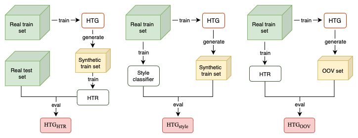

# 🔥 Rethinking HTG Evaluation: Bridging Generation and Recognition

 

 

  <b>
    <a href="https://arxiv.org/abs/2303.14736">ArXiv</a>
    |
    <a href="">Paper</a>
    |
    <a href="">Poster</a>
    |
    <a href="https://sites.google.com/view/cegis-workshop">CEGIS Workshop - ECCV 2024</a>
    
  </b>

 

## 📢 Introduction

  

  Overview of the proposed metrics

